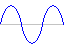

# MicroEngine


MicroEngine is a hyper-simple game engine for building retro-style 
games on the web that work on desktop and mobile devices. 

- [Quick Start](#Quick-Start)
- [About](#About)
- [Commands](#Commands)  
- [Appendix](#Appendix)

&nbsp; &nbsp; &nbsp; 

&nbsp;


<!-- ******************************************************************************************** -->
#
## Quick Start 
//[Home](#MicroEngine)/Quick Start


_SETUP_

1. Put the `micro.html` and `game.js` in the same folder
2. Add your game code to `game.js` ([See Commands](#Commands))
3. Open the `micro.html` file in  a modern browser and play!

&nbsp;

_QUICK EXAMPLE_  
An example program is provided below to help get you started. Check 
out the [Commands](#Commands) section for details on each 
MicroEngine command.
```javascript
//game.js

var px = 10;
var py = 30;

function update() {

    rect(0,0,160,120,0); //clear screen

    text(1,1,7,"Move Rect with D-Pad");

    px += held(1) - held(3);
    py += held(2) - held(0);

    rect(px,py,10,10,5);
}
```
&nbsp; 

&nbsp; 

_MORE ON DEVELOPMENT_

You can rename the `micro.html` file to whatever you like. But, the
`game.js` file cannot be renamed because the engine is looking for it by name.
  
You **MUST** define the `update` function in your `game.js` file. The MicroEngine will 
call the `update` function 60 times a second using JavaScript's `requestAnimationFrame` 
function. 

You can include additonal JavaScript files (.js) with your project by
using the [include](#include-path-) command.  

&nbsp;

_Intellisense_  
MicroEngine has a TypeScript definition file `micro_engine.d.ts` 
that provides intellisense information for all MicroEngine [Commands](#Commands).
If you are developing in VSCode, then put the `micro_engine.d.ts` file 
next to your `game.js` file. Add the line comment below to the top 
of `game.js` to enable the MicroEngine intellisense.
```javascript
/// <reference path="micro_engine.d.ts" />
```  
_notice this comment begins with a triple slash "`///`"._  

&nbsp; 


&nbsp;
  
&nbsp;

<!-- ******************************************************************************************** -->
#
## About
//[Home](#MicroEngine)/About

MicroEngine is a hyper-simple game engine for building retro-style 
games on the web. MicroEngine can run on the desktop with keyboard 
controls or on mobile devices. See the [buttons](#buttons) section
in the appendix for more information.

MicroEngine supports 8 colors. These colors are referenced by 
an index 0 thru 7. See the [colors](#colors) section in the appendix
for details.

MicroEngine supports a constant resolution of 160 by 120 pixels. 
The display will scale based on the platform. Check out the [Screen](#screen)
section in the appendix for more details. There is one font 
supported, see the [Font](#Font) section in the appendix for more details.

MicroEngine supports basic drawing commands and one sprite
drawing command. Sprites are stored as 2D JavaScript arrays of 
single-digit numbers 0-7. Graphics commands are listed under
_Graphics_ in the [Commands](#commands) section.

MicroEngine supports retro sound effects with the [play](#play-channel-speed-voice-loop.notes-) 
command. MicroEngine supports 4 audio channels with several different voices
for sound effects and music. Audio commands are listed under _Audio_ in the [Commands](#commands) section.
See the [Audio](#Audio) section of the Appendix for additional information.


&nbsp;

&nbsp;

&nbsp;

&nbsp;


&nbsp;
  
&nbsp;


<!-- ******************************************************************************************** -->
#
## COMMANDS
//[Home](#MicroEngine)/Commands  
  
MicroEngine provides a simplified set of commands to handle
graphics, audio, and controls. It also provides a few helper
functions commonly used in 2D games. A complete list of commands
is provided below. 
- System
  - [`update()`](#update)  
  - [`include( <path> )`](#include-path-)
  - [`ready()`](#ready)
- Graphics
  - [`plot( <x>, <y>, <color> )`](#plot-x-y-color-)  
  - [`rect( <x>, <y>, <w>, <h>, <color>, [optColor2] )`](#rect-x-y-w-h-color-optColor2-)  
  - [`draw( <x>, <y>, <spriteArray>, [optMaskColor] )`](#draw-x-y-spriteArray-optMaskColor-)  
  - [`text( <x>, <y>, <color>, <message> )`](#text-x-y-color-message-)  
- Audio
  - [`play( <channel>, <speed>, <voice>, <volume>, <loop>, <notes> )`](#play-channel-speed-voice-volume-loop-notes-)
  - [`stop( <channel> )`](#stop-channel-)
- Controls
  - [`held( <buttonIndex> )`](#held-buttonIndex-)  
  - [`pressed( <buttonIndex> )`](#pressed-buttonIndex-)  
  - [`released( <buttonIndex> )`](#released-buttonIndex-)  
  - [`clear()`](#clear)
- Helpers
  - [`dist( <x1>, <y1>, <x2>, <y2> )`](#dist-x1-y1-x2-y2-)  
  - [`inside( <px>, <py>, <rx>, <ry>, <rw>, <rh>)`](#inside-px-py-rx-ry-rw-rh-)  
  - [`overlap( <x1>, <y1>, <w1>, <h1>, <x2>, <y2>, <w2>, <h2> )`](#overlap-x1-y1-w1-h1-x2-y2-w2-h2-)  
  - [`rand( <range> )`](#rand-range-)


&nbsp;

&nbsp;

&nbsp;

&nbsp;


<!-- ******************************************************************************************** -->
#
### `update()`

//[Home](#MicroEngine)/[Commands](#Commands)/update

| Parameter | Type | Description |
| --- | --- | --- |
| (_none_) |  | _This function does not have parameters_

&nbsp;

**_Information_**

The MicroEngine revolves around the `update` function. This function is 
called about 60 times a second. Your `game.js` file **Must** include the 
`update` function. The MicroEngine is looking for this function. Let's 
look at a simple example.

&nbsp; 

**_Example_**
```javascript
//game.js

function update() {

    rect(0,0,160,120,5);
    
    text(10,10,3,"Hello world");

} 
```
In the example above, every time the update function is called, it
blanks out the screen by using the [`rect`](#rect-x-y-w-h-color-) command to draw a rectangle
that's the same size of the entire screen. Then, it writes "Hello world"
to the screen.  

The MicroEngine display is fixed at 160x120 pixels. See the [Screen](#screen)
section in the appendix for more details. 
  
&nbsp;
  
&nbsp;
  
<!-- ******************************************************************************************** -->
#
### `include( <path> )`
//[Home](#MicroEngine)/[Commands](#Commands)/include

| Param | Type | Description |
| --- | --- | --- |
| `<path>` | string | path to script file 
&nbsp;  
**_Information_**

The `include` function allows you to include additional code from other script
files. Use this command at the top of the `game.js` file. Once all code from
every include has loaded, the MicroEngine will call the `ready` function. 

As you can see from the example below, we create a new `Player` object 
from inside the `ready` function. This ensures that the `player.js` file
has finished loading. You can have as many `includes` as you want. MicroEngine
will handle nested and circular includes. However, this practice is not recomended.

&nbsp;  

**_Example_**

```javascript
//player.js

var Player = function () {
    this.x = 10;
    this.y = 10;
};
Player.prototype.move = function () {

    this.x += held(1) - held(3);
    this.y += held(2) - held(0);
};
Player.prototype.render = function () {

    rect(this.x,this.y,20,20,5);
};

```

&nbsp;

```javascript
//game.js

include("player.js");

var player; 


// ready() is called after all code has loaded, but 
// before update() is called for the first time.
function ready() {

    // create the Player object after the player.js 
    // file has been loaded.
    player = new Player();
}


function update() {

    rect(0,0,160,120,0); // clear the screen
    text(1,1,5,"Test: include()");

    player.move();
    player.render();
}

```

&nbsp;  

&nbsp;  

<!-- ******************************************************************************************** -->
#
### `ready()`
//[Home](#MicroEngine)/[Commands](#Commands)/ready

| Parameter | Type | Description |
| --- | --- | --- |
| (none) |  | _This function does not have parameters._

&nbsp;  

**_Information_**

The `ready` function is called after all code has been included. This
function is called before the first call to [`update`](#update) is made
by the engine. Use this function when you're including code you want
to reference before the game starts. See the [`include`](#include-path-) 
command for details and an example.

&nbsp;  

&nbsp;  


<!-- ******************************************************************************************** -->
#
### `plot( <x>, <y>, <color> )`
//[Home](#MicroEngine)/[Commands](#Commands)/plot

| Parameter | Type | Description |
| --- | --- | --- |
| `<x>` | number | Position of the pixel on the X-axis  
| `<y>` | number | Position of the pixel on the Y-axis  
| `<color>` | number | Color index that defines the color of the pixel 

&nbsp;

**_Information_**

The plot function will plot a single pixel at the provided `x`,`y` position
on the screen with the provided `color` index ([See colors](#colors)) 
This function is useful if you need to add special particle effects or
are customizing a sprite.  

&nbsp;

**_Example_**
```javascript
//game.js


function update() {

    rect(0,0,160,120,0); //clear the screen

    plot(10,10,1); //plots a red pixel on the screen
}
```
&nbsp;

&nbsp;


<!-- ******************************************************************************************** -->
#
### `rect( <x>, <y>, <w>, <h>, <color>, [optColor2] )`
//[Home](#MicroEngine)/[Commands](#Commands)/rect

| Parameter | Type | Description |
| --- | --- | --- |
| `<x>` | number | x coordinate of the upper-left corner of the rectangle
| `<y>` | number | y coordinate of the upper-left corner of the rectangle
| `<w>` | number | width in pixels of the rectangle
| `<h>` | number | height in pixels of the rectangle
| `<color>` | number | color index representing the color<br>of the rectangle ([See Colors](#colors))
| `[optColor2]` | number | (Optional) second color index representing the _other_ color of a dithered rectangle ([See Colors](#colors))

&nbsp;

**_Information_**

The `rect` function will draw a rectangle to the screen starting at the 
provided `<x>`,`<y>` position, that is  `<w>` pixels wide by `<h>` pixels high. The
rectangle will be filled based on the provided `<color>` index. ([See colors](#colors)) This function is also used to clear the
screen by starting a (x:0,y:0) and providing a width of 160 and a height of 120.

You can draw a _dithered_ rectangle by providing a second color for the `[optColor2]` parameter.

&nbsp;

**_Example_**
```javascript
//game.js


function update() {

    //clears the screen
    rect(0,0,160,120,0);

    //draws a green (index 4) rectangle to the screen
    rect(10,10,40,40,4); 

    //draws a dithered rectangle to the screen,
    //red (index 1) and blue (index 5)
    rect(60,10,40,40,1,5);
}
```
  
&nbsp;  

&nbsp;  

<!-- ******************************************************************************************** -->
#
### `draw( <x>, <y>, <spriteArray>, [optMaskColor] )`
//[Home](#MicroEngine)/[Commands](#Commands)/draw

| Parameter | Type | Description |
| --- | --- | --- |
| `<x>` | number | x coordinate of the upper-left corner of the sprite
| `<y>` | number | y coordinate of the upper-left corner of the sprite
| `<spriteArray>` | array | 2D array of numbers representing color indexes of each pixel of the sprite
| `[optMaskColor]`| number | (OPTIONAL) color index that defines a color index to be treated as transparent ([See Colors](#colors))

&nbsp;

**_Information_**

The `draw` command will display a sprite starting at the `<x>`,`<y>` 
position. A sprite in MicroEngine is just a 2D JavaScript array of numbers
that represent color indexes. The array does **NOT** have to be square in 
size. Each row can be a different width. The array's height can be as big as
you want. So, you can build a sprite that is larger than the display size. 
This can be useful if you are rendering background like a city skyline. 

In the example below the `sprite_1` variable
holds an 8 by 8 array that represents a smiley face. You will notice that 
the areas around the edges of the "face" have a color index of '0'. This 
normally represents the color black. However, when the `draw` command is
called, we also pass in a masking index ( `[optMaskColor]` ) of '0'. This tells 
the draw function to treat the color '0' as transparent. This allows you
to draw complex sprites. If you omit the masking index, then all values
will be treated as their normal color. So, when using a masking index, 
you will have to sacrifice 1 of the 8 colors for transparency. 

&nbsp;

**_Example_**
```javascript
var sprite_1 = [
    [0,0,2,2,2,2,0,0],
    [0,2,6,2,2,6,2,0],
    [0,2,6,2,2,6,2,0],
    [2,2,2,2,2,2,2,2],
    [2,2,2,2,2,2,2,2],
    [0,2,6,2,2,6,2,0],
    [0,2,2,6,6,2,2,0],
    [0,0,2,2,2,2,0,0]
];


function update() {

    rect(0,0,160,120,0); //clear screen

    draw(10,10,sprite_1,0); //draw our sprite
}

```
  
&nbsp;  

&nbsp;  

<!-- ******************************************************************************************** -->
#
### `text( <x>, <y>, <color>, <message> )`
//[Home](#MicroEngine)/[Commands](#Commands)/text

| Parameter | Type | Description |
| --- | --- | --- |
| `<x>` | number | start position of the message on the x-axis
| `<y>` | number | start position of the message on the y-axis
| `<color>` | number | color index that defines the color of <br> the text ([See Colors](#colors))
| `<message>` | string | string representing the text to be displayed

&nbsp;

**_Information_**

The `text` function will display the provided `<message>` starting at
the provided `<x>`,`<y>` position using the provided `<color>` index. ([See colors](#colors))  

MicroEngine uses a 6x6 pixel monospaced font. Given that the 
MicroEngine display is 160x120 pixels, this allows for 26x20 characters 
on the display.  If a character cannot be displayed, then a '?' is used instead.
MicroEngine ignores case. So, "a" and "A" are both displayed as a capital 'A'. 
([See Font](#Font) for more details)

&nbsp;

**_Example_**
```javascript
//game.js

function update() {
    
    rect(0,0,160,120,0); //clear the screen
    
    text(10,10,2,"Gold Text");
}

```
  
&nbsp;  

&nbsp;  


<!-- ******************************************************************************************** -->
#
### `play( <channel>, <speed>, <voice>, <volume>, <loop>, <notes> )`
//[Home](#MicroEngine)/[Commands](#Commands)/play

| Parameter | Type | Description |
| --- | --- | --- |
| `<channel>` | number | Channel on which the sound will play. <br> (Valid values are 0 thru 3)
| `<speed>` | number | Number of notes played per second. 
| `<voice>`   | number | index of the sound wave type to be used as the voice for the notes. 
| `<volume>`   | number | number between 0 and 1 representing the volume of the channel
| `<loop>` | boolean | Set to true if you want the notes to be played on a loop
| `<notes>` | Array&lt;string&gt; | An array of strings representing notes to play ([See Audio](#Audio)) 

&nbsp;

**_Information_**

The `play` command handles all audio. MicroEngine can play 4 channels at the same time. This function will play the 
provided `<notes>` at the given `<speed>` for in the specified `<voice>`. 

If `<loop>` is set to `true` then the notes will play in a loop like a 
musical track.  You can stop a channel that is playing using the [`stop`](#stop-channel-) command.

The `<speed>` parameter represents the number notes that are played per second. So, the higher this number,
the faster the notes will be played. 

The `<notes>` parameter is a array of strings where each string represents a valid note that MicroEngine 
can play. MicroEngine can play the full range of notes between the 2nd and 7th octaves. There is partial
support for the first octave. You can use the string "-" to represent a silent note. 
([See Audio](#Audio) for more details)


|Index | Voice Type
| --- | --- |
| `0` | Sine 
| `1` | Saw 
| `2` | Square 
| `3` | Triangle 
| `4` | Noise 


&nbsp;

**_Example_**
```javascript
//game.js

function update() {

    //if the action button is pressed
    // (the 'C' key on the keyboard)
    if (pressed(4)) {

        // play a C in the third octave as a triangle wave 
        // for 1/4 of a second on channel 0 at 50% (0.5) volume.
        play(0,4,3,0.5,false,["C3"]); 
    }
}

```
  
&nbsp;  

&nbsp;  
<!-- ******************************************************************************************** -->
#
### `stop( <channel> )`
//[Home](#MicroEngine)/[Commands](#Commands)/stop

| Parameter | Type | Description |
| --- | --- | --- |
| `<channel>` | number | Audio channel you want to stop <br> (Valid values are 0 thru 3)
&nbsp;

**_Information_**

The `stop` command will stop an audio channel if that channel is currently playing. 
To play sounds and music see the [`play`](#play-channel-speed-voice-volume-loop-notes-) command.


&nbsp;

**_Example_**
```javascript
//game.js

//Ready function is called by MicroEngine
//after everything is loaded, but before the
//engine starts calling the update() function
function ready() {

    //start music
     play(0,2,3,true,["C3","D3","-","E3","F3","D3","-","-","-"]);
}

function update() {

    //if the action button is pressed
    // (the 'C' key on the keyboard)
    if (pressed(4)) {

        //stop music on channel 0
        stop(0);
    }
}

```
  
&nbsp;  

&nbsp;  
<!-- ******************************************************************************************** -->
#
## `held( <buttonIndex> )`
//[Home](#MicroEngine)/[Commands](#Commands)/held

| Parameter | Type | Description |
| --- | --- | --- |
| `<buttonIndex>` | number | Index of the button to be checked

&nbsp;

**_Information_**

The `held` function will return `true` if the button corresponding
to the provided `<buttonIndex>` is currently held down. ([See buttons](#buttons))
Otherwise it will return `false`. Use this command when you're coding 
for continuous action like fluid movement on the directional pad 
(arrow keys). Don't use this command if you are trying to navigate
a menu. Instead use [pressed](#pressed-buttonIndex-). 

&nbsp;

**_Example_**
```javascript
//game.js
//use the arrow keys on the keyboard, or
//the virtual directional-pad on mobile devices

var x = 8; 
var y = 8;

function update() {

    rect(0,0,160,120,0); //clear the screen

    // UP and DOWN Movement -----------------------

        // if the dpad up button is held down
        // then subtract 1 from y position. 
        if (held(0)) {
            y -= 1;
        }

        // if the dpad down button is held down
        // then add 1 to the y position.
        if (held(2)) {
            y += 1;
        }
    
    // RIGHT and LEFT Movement --------------------

        // if the dpad right is held down,
        // then add 1 to x position
        if (held(1)) {
            x += 1;
        }

        //left the dpad left is held down,
        //then subtract 1 from x position
        if (held(3)) {
            x -= 1;
        }

    // Draw a Red square at the current x,y position
    rect(x,y,10,10,1);

}
```

  
&nbsp;  

&nbsp;  

<!-- ******************************************************************************************** -->
#
## `pressed( <buttonIndex> )`
//[Home](#MicroEngine)/[Commands](#Commands)/pressed

| Parameter | Type | Description |
| --- | --- | --- |
| `<buttonIndex>` | number | Index of the button to be checked


&nbsp;

**_Information_**

The `pressed` function will return `true` if the button corresponding
to the provided `<buttonIndex>` was pressed. ([See buttons](#buttons))
Otherwise it will return `false`. Use this command when you're coding 
for step-wise action like grid movement, or a menu selection screen. This event will only return `true` once per button press. So, if the button is held down, this function will **NOT** continuously return `true`. Don't use this command if you are trying to program fluid 
movement, like moving a character around on the screen with the 
directional pad. Instead use [held](#held-buttonIndex-). 

In the example below, we are using the `pressed` function to 
see when to move the menu cursor. Run this example and hold the up
or down button down. Notice how the menu select only responds when
the button is first pressed, but does not continuously update the
cursor position. 

&nbsp;

**_Example_**

```javascript
//game.js

var menuIndex = 0;

function update() {

    rect(0,0,160,120,0); //clear the screen

    text(10,10,2,"Start Game");
    text(10,18,2,"Load Game");
    text(10,26,2,"About");

    //draw menu cursor at specific menu index
    text(2,10+(menuIndex*8),4, ">"); 

    //if the dpad up button pressed,
    //then subtract 1 from the menuIndex
    if (pressed(0)) {
        menuIndex -= 1;
    }

    //if the dpad down button pressed, 
    //then add one to the menuIndex
    if (pressed(2)) {
        menuIndex += 1;
    }

    //Make sure the menu index wraps
    menuIndex = menuIndex < 0 ? 2 : menuIndex;
    menuIndex = menuIndex > 2 ? 0 : menuIndex;

}

```

  
&nbsp;  

&nbsp;  

<!-- ******************************************************************************************** -->
#
## `released( <buttonIndex> )`
//[Home](#MicroEngine)/[Commands](#Commands)/released

| Parameter | Type | Description |
| --- | --- | --- |
| `<buttonIndex>` | number | Index of the button to be checked

&nbsp;

**_Information_**

The `released` function will return `true` if the button corresponding
to the provided `<buttonIndex>` was released. ([See buttons](#buttons))
Otherwise it will return `false`. This event will only return `true`
once per button release. So, if the button is released, this function
will **NOT** continuously return `true`. Don't use this command if you
are trying to program fluid movement, or stepwise movement. 
Instead use [held](#held-buttonIndex-) or [pressed](#pressed-buttonIndex-) respectively. 

So when do you use `released`? Well, that is more a question of 
game mechanics. Suppose a player can charge a character's jump
power by holding down the action button. Then, when they release
the action button, the character jumps based on how long the player
held down the button. In this case, you'd use a combination of 
the [held](#held-buttonIndex-) and `released` functions.
See example below.

Example:
```javascript
//game.js

var charge = 0;

function update() {

    rect(0,0,160,120,0); //clear the screen
    
    text(10,10,4,"HOLD C TO CHARGE");
    text(10,30,4,"CHARGE:" + Math.floor(charge));

    //hold down the 'C' button to charge
    if (held(4)) {

        charge += 0.2;
        charge = charge < 100 ? charge : 100;
    }

    //on release jump and reset the charge
    if (released(4)) {
        
        text(10,40,7,"JUMP!!!!!!!!!!!");
        charge = 0;
    }
}
```


  
&nbsp;  

&nbsp;  

<!-- ******************************************************************************************** -->
#
## `clear()`
//[Home](#MicroEngine)/[Commands](#Commands)/clear

| Parameter | Type | Description |
| --- | --- | --- |
| (none) |  | _This function does not have parameters._


The `clear` command will clear all the button states so that `held`,
`pressed`, and `released` will all return `false` after `clear` is
called. Button states return to their current state the next time the `update` function is called. This can create a strobe effect with the 
`held` function because the state is cleared for one frame, and
updates then next frame if a player holds down the button. 

The `clear` is useful when you are transitioning between a menu
screen and the start of a game. For Example, suppose a player presses
the 'C' button to start the game, and the 'C' button fires a
weapon during gameplay. You don't want the player to press the
'C' button and immediately start to fire their weapon when the 
game starts. 


Example:

```javascript
//game.js

function update() {

    rect(0,0,160,120,0); //clear the screen
    
    text(5,5,7,"clear() test");

    clear();
    
    // 'C' button
    if (held(4)) {
        
        // this will never happen because the buttons
        // have been cleared above. 'held(4)' will
        // always return false. remove the clear() 
        // function and try again to see it work 
        // properly.
        text(5,15,7,"C button held down");
    }
}
```

  
&nbsp;  

&nbsp;  

<!-- ******************************************************************************************** -->
#
## `dist( <x1>, <y1>, <x2>, <y2> )`
//[Home](#MicroEngine)/[Commands](#Commands)/dist 

| Param | Type | Description |
| --- | --- | --- |
| `x1` | number | Position of point 1 on the X-axis
| `y1` | number | Position of point 1 on the Y-axis
| `x2` | number | Position of point 2 on the X-axis
| `y2` | number | Position of point 2 on the Y-axis


The `dist` function returns the distance between two points (x1,y1)
and (x2,y2). This command is commonly used in 2D games. For example, 
you could use the `dist` function to calculate the distance between 
the player and the power-up by passing in the x,y positions of both
and checking the result. See below for an example. 

Example:
```javascript
//game.js
// NOTE: This is a simple example to demo the 'dist' function.
//       This is NOT an example of best-practices.

var player = {
    x: 10,
    y: 10,
    health: 50
};

var heart = {
    x: 100,
    y: 100,
    amount: 10,
    picked: false
};

function update() {

    rect(0,0,160,120,0); //clear the screen

    // PLAYER ----------------------------------------
        
        // Draw the player's health at the top 
        // of the screen
        text(0,0,7,"HEALTH:" + player.health);

        // draw the player
        rect(player.x,player.y,10,10,4);

        // Handle player movement
        player.x += held(1) - held(3);
        player.y += held(2) - held(0);


    // HEART -----------------------------------------

        //if the heart hasn't been picked up by the player
        if (heart.picked == false) {

            //draw the heart
            rect(heart.x,heart.y,4,6,1);

            //see if the player is close enough to the heart
            if (dist(player.x,player.y,heart.x,heart.y) < 10) {

                //set the picked so we stop rendering the heart
                heart.picked = true;

                //update the player's health
                player.health += heart.amount;
            }
        }

}

```

  
&nbsp;  

&nbsp;  

<!-- ******************************************************************************************** -->
#
### `inside( <px>, <py>, <rx>, <ry>, <rw>, <rh> )`
//[Home](#MicroEngine)/[Commands](#Commands)/inside

| Param | Type | Description |
| --- | --- | --- |
| `<px>` | number | x coordinate of point to test
| `<py>` | number | y coordinate of point to test
| `<rx>` | number | x coordinate of the upper-left corner of the rectangle
| `<ry>` | number | y coordinate of the upper-left corner of the rectangle
| `<rw>` | number | width of the rectangle
| `<rh>` | number | height of the rectangle


&nbsp;  
**_Information_**

The `inside` function tests if a point (`<px>`,`<py>`) is inside a rectangle
that is positioned at `<rx>`,`<ry>` and is `<w>` pixels wide and `<h>` pixels
height. If the point is inside the rectangle, then this function will return `true`.
Otherwise it will return `false`. You can use this function when calculating
collisions with point-based items. For example, If you want to check if a
projectile has collided with a sprite, then you would check the x,y position
of the projectile against the sprite's x,y position and the sprite's width and 
height. 


&nbsp;  

**_Example_**
```javascript
//game.js

var player = { x: 10, y: 10, size:15};
var ball = { x:100, y: 100 };

function update() {

    rect(0,0,160,120,0); // clear the screen

    text(1,1,5,"Test: inside()");

    // PLAYER -------------------------------------
        
        // handle player movement
        player.x += held(1) - held(3);
        player.y += held(2) - held(0);

        // draw player to the screen
        rect(player.x,player.y,player.size,player.size,6);

    // BALL --------------------------------------

        // move the ball diagonally up-left
        ball.x = (ball.x < 0) ? 100 : ball.x-0.1;
        ball.y = (ball.y < 0) ? 100 : ball.y-0.1;

        // draw ball to the screen

        plot(Math.floor(ball.x),Math.floor(ball.y),7);


    // if the ball collides with the player, then display a message
    if (inside(ball.x,ball.y, player.x,player.y, player.size, player.size)) {

        text(0,8,7,"Collided!!");
    }
}

```

&nbsp;  

&nbsp;  

<!-- ******************************************************************************************** -->
#
### `overlap( <x1>, <y1>, <w1>, <h1>, <x2>, <y2>, <w2>, <h2> )`
//[Home](#MicroEngine)/[Commands](#Commands)/overlap

| Param | Type | Description |
| --- | --- | --- |
| `<x1>` | number | x coordinate of the upper-left corner of the first rectangle
| `<y1>` | number | y coordinate of the upper-left corner of the first rectangle
| `<w1>` | number | width in pixels of the first rectangle
| `<h1>` | number | height in pixels of the first rectangle
| `<x2>` | number | x coordinate of the upper-left corner of the second rectangle
| `<y2>` | number | y coordinate of the upper-left corner of the second rectangle
| `<w2>` | number | width in pixels of the second rectangle
| `<h2>` | number | height in pixels of the second rectangle

&nbsp;  
**_Information_**

The `overlap` function tests if two rectangles are overlapping each other. 
This function requires the x, y, width, and height of the two rectangles
you want to test. This first four arguments represent the x, y, width, and height of
the first rectangle and the second four arguments represent the second rectangle. 
The x,y coordinates represent the upper-left corner of each rectangle. 
```javascript
//       FIRST RECTANGLE          SECOND RECTANGLE      
overlap( <x1>, <y1>, <w1>, <h1>,  <x2>, <y2>, <w2>, <h2> );
```
This function can be helpful for basic collision detection between two sprites. If you know
the position (x,y) of each sprite and their corresponding size (width and height), then you
can use this function to detect any collision. In the example below, we have a 
smiley-face sprite that represents the player, and a monster sprite that represents
an enemy. The screen will flash a message when the player sprite overlaps the monster sprite. 
*NOTE* This method is detecting if two rectangles are overlapping. It does not handle
pixel-perfect collision between sprites. So, if you have a more abnormally shaped sprite,
then you will have to be clever in how you define the sprite's boundary rectangle.


&nbsp;

**_Example_**
```javascript
//game.js
// Example of the overlap function

var player = { x: 10, y: 10};
var monster = { x:100, y: 100 };

// 8 by 8 smiley face
var playerSprite = [
    [0,0,2,2,2,2,0,0],
    [0,2,6,2,2,6,2,0],
    [0,2,6,2,2,6,2,0],
    [2,2,2,2,2,2,2,2],
    [2,2,2,2,2,2,2,2],
    [0,2,6,2,2,6,2,0],
    [0,2,2,6,6,2,2,0],
    [0,0,2,2,2,2,0,0]
];

// 5 by 8 pixel monster
var monsterSprite = [
    [0,0,4,0,0],
    [0,4,4,4,0],
    [4,6,4,6,4],
    [4,6,4,6,4],
    [4,4,4,4,4],
    [4,4,4,4,4],
    [6,1,6,1,6],
    [6,1,6,1,6]
];

function update() {

    rect(0,0,160,120,0); // clear the screen

    text(1,1,5,"Test: overlap()");
    text(1,110,6,"Use controls to move");

    // PLAYER -------------------------------------
        
        // handle player movement
        player.x += held(1) - held(3);
        player.y += held(2) - held(0);

        // draw player Sprite to the screen, use color 0 as transparent
        draw(player.x,player.y,playerSprite,0);

    // MONSTER --------------------------------------

        // move the monster diagonally up-left
        monster.x = (monster.x < 0) ? 100 : monster.x-0.1;
        monster.y = (monster.y < 0) ? 100 : monster.y-0.1;

        // draw monster sprite to the screen, use color 0 as transparent
        draw(Math.floor(monster.x), Math.floor(monster.y), monsterSprite, 0);


    //if the player overlaps the monster, then display a message.
    if(overlap( player.x, player.y, 8, 8, monster.x, monster.y, 5, 8)) {

        text(1,8,rand(7),"Overlapped!!");
    }
}
```

&nbsp;  

&nbsp;  

<!-- ******************************************************************************************** -->
#
### `rand( <range> )`
//[Home](#MicroEngine)/[Commands](#Commands)/rand

| Param | Type | Description |
| --- | --- | --- |
| `<range>` | number | the max integer range from which a number is randomly selected

&nbsp;  

**_Information_**

The `rand` function returns a random integer up to, but not including `<range>`. So, the number generated
includes the possibility of zero all the way up thru `<range>-1`. For example, `rand(6)` will
randomly return a `0`, `1`, `2`, `3`, `4`, or `5`, but not a `6`.  This function can be helpful
when generating pseudo-random events in your game. It can also be used to create flashing
text on the screen. 


&nbsp;  

**_Example_**
```javascript
//game.js
// rand example

var rndColor = 7;

function update() {

    rect(0,0,160,120,0); // clear the screen
    text(1,1,5,"Test: rand()");

    // get a random number 0 thru 7
    rndColor = rand(8);

    // draw text with random color index. 
    text(10,10,rndColor,"Random! (" + rndColor + ")");
}

```

&nbsp;  

&nbsp;

&nbsp;

&nbsp;

&nbsp;

&nbsp;

&nbsp;

&nbsp;

&nbsp;

&nbsp;

&nbsp;


# Appendix
//[Home](#MicroEngine)/Appendix

Here are some additional details about the MicroEngine's features and limitations.
- [Colors](#colors)
- [Buttons](#buttons)
- [Screen](#Screen)
- [Font](#Font)
- [Audio](#Audio)
&nbsp;


<!-- ******************************************************************************************** -->
#
## Colors
//[Home](#MicroEngine)/[Appendix](#Appendix)/Colors

The MicroEngine supports 8 colors. Each graphics function except the draw function requires a color index value. These values are listed below.
Names, RGB values, and Hex values are provided for convenience, but the
MicroEngine functions require the `color` index value to be a number 0 thru 7.  


| Index | Name | RGB | Hex |
| --- | --- | --- | --- |
| `0` |    Black  |   `rgb(0,0,0)`       |    `#000000`
| `1` |    Red    |   `rgb(200,0,75)`    |    `#c8004b`
| `2` |    Yellow |   `rgb(255,200,0)`   |    `#ffc800`
| `3` |    Brown  |   `rgb(160,80,20)`   |    `#a05014`
| `4` |    Green  |   `rgb(100,200,0)`   |    `#64c800`
| `5` |    Blue   |   `rgb(0,150,255)`   |    `#0096ff`
| `6` |    Purple |   `rgb(80,40,55)`    |    `#502837`
| `7` |    White  |   `rgb(250,250,250)` |    `#f8f8f8`

&nbsp;

If you dither these colors (alternating pixels between two colors), 
you can imitate additional colors.( _and that cool retro feel_ ).


The example program below will display all 8 colors on the screen. 
Black, the first color, is also the same color as the background. 
So, it will look like a color is missing. 

Example:
```javascript
//game.js

function update() {

    rect(0,0,160,120,0); //clear the screen

    for (var c= 0; c < 8; c +=1) {

        text(0,6+(c*7),5,c); //blue color index text
        rect(6,6+(c*7),6,6,c); //6x6 square of color 'c'
    }
}
```
  
&nbsp;  

&nbsp;  


<!-- ******************************************************************************************** -->
#
## Buttons
//[Home](#MicroEngine)/[Appendix](#Appendix)/Buttons


The MicroEngine controls consist of a directional pad and three 
buttons X, C, and F. X and C are traditional "action" buttons, while
the F key looks like a start or menu button. 
On the desktop, MicroEngine is controlled with the arrow 
keys that act as the directional pad, and the 'X', 'C', and 'F' letter-keys. On mobile devices MicroEngine listens for touch events 
on the virtual directional-pad and virtual buttons rendered on the page. 

On mobile devices, these virtual controls will appear on the left- and 
right-sides of the screen when playing in landscape mode, and below the 
screen when playing in portrait mode. _NOTE: Controls are also rendered 
in desktop mode, but are non-functional._


Each of the buttons has a unique button index that is used with the 
three button-query functions: [held](#held-buttonIndex-), [pressed](#pressed-buttonIndex-), and
[released](#released-buttonIndex-).

| Index | Button Name | Keyboard Map 
| --- | --- | --- |
| `0` | D-Pad Up | Up-Arrow Key
| `1` | D-Pad Right | Right-Arrow Key
| `2` | D-Pad Down | Down-Arrow Key
| `3` | D-Pad Left | Left-Arrow Key
| `4` | C Button | 'C' Key
| `5` | X Button | 'X' Key
| `6` | F Button | 'F' Key 


  
&nbsp;  

&nbsp;  


<!-- ******************************************************************************************** -->
#
## Screen
//[Home](#MicroEngine)/[Appendix](#Appendix)/Screen

The MicroEngine supports a constant resolution of 160 by 120 pixels. 
The display's pixels will scale based on the platform. You may 
notice some stretching or warping on mobile devices in landscape mode.

On mobile devices, virtual controls will appear on the left- and right-sides of the screen when playing in landscape mode, and below the screen when playing in portrait mode. NOTE: Controls are also rendered in desktop mode, but are non-functional.


Graphics commands that require an x,y position are based on an origin 
in the upper left corner of the screen. 

&nbsp; &nbsp; &nbsp; &nbsp; &nbsp; &nbsp; 


  
&nbsp;  

&nbsp;  


<!-- ******************************************************************************************** -->
#
## Font
//[Home](#MicroEngine)/[Appendix](#Appendix)/Font

All text is rendered in a 6x6 pixel mono-spaced font. The screen 
can display 20 rows of text. Each row can hold up to 26 characters.
Each symbol is actually a 5x5 pixel square with a 1-pixel border on 
the left and bottom. Below are the supported characters. 
If a you try to display a character that's not in this list,
MicroEngine will display a question mark instead.

```
    A B C D E F G H I J K L M
    N O P Q R S T U V W X Y Z
    0 1 2 3 4 5 6 7 8 9 ? . !
    , + @ # $ % ^ & * ( ) - =
    " ` ' _ [ ] { } / \ | < >
    : ; ~
```


<!-- ******************************************************************************************** -->
#
## Audio
//[Home](#MicroEngine)/[Appendix](#Appendix)/Audio

MicroEngine supports four-channel audio. This means you can play four separate  sounds or music tracks
at the same time. MicroEngine provides retro-style voices and a range of notes. Octaves 2 through 7
are fully supported. A few notes from the first octave are also supported. You can set the playback 
speed of notes and whether the notes are played on a loop like a musical track. There are only
two audio commands: [`play`](#play-channel-speed-voice-volume-loop-notes-) and [`stop`](#stop-channel-). However, 
with these two commands, you can create a wide range of sound effects and music.

&nbsp;

### Channels
MicroEngine supports four audio channels. They are referenced by index 0 through 3.
```javascript
    var channel = 0;
    var speed = 2; // 2 notes per second
    var voice = 3; // 3 triangle wave
    var volume = 0.5; // value between 0 and 1
    var loop = false;  //don't loop this channel
    var notes =["C2","D2","E2","F2","G2","A2","B2"];

    play(channel,speed,voice,volume,loop,notes);
```

### Voices
MicroEngine supports 5 different voices. They are listed in the table below. 
Different voices are good for different types of sounds. For example, 
the noise voice can be used for explosion sounds. 

| Index | Name | Pattern | Description
| --- | --- | --- | --- 
| 0   | Sine Wave |  | Smooth, clean tone
| 1   | Sawtooth Wave |  | Harsh, buzzing tone
| 2   | Square Wave |   | Crisp, "computer-sounding" tone
| 3   | Triangle Wave |   | Dampened, bass-like tone
| 4   | Noise  |   | white-noise, radio-static tone

&nbsp;

### Musical Notes
Notes are provided to the `play` command as a series of strings in an 
array.
```javascript
   var notes =["C2","D2","E2","F2","G2","A2","B2"];
```
The diagram below shows all the valid notes you can use with the `play` 
command. This diagram is layed out like a piano. Color groupings denote
the octave.


You can chain notes together to create different sound effects. 
Explosions are best rendered with the `noise` voice.  Speed can 
also affect how voices sound. Play around with different speeds
and notes to get the desired effect. 
